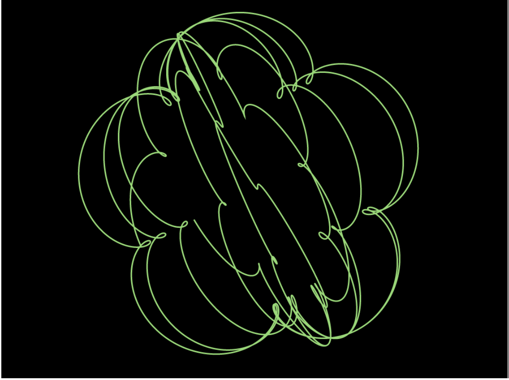

# Spheromaniac

To generate typical [spirograph](https://en.wikipedia.org/wiki/Spirograph)-like patterns (aka [mathematical roulettes](https://en.wikipedia.org/wiki/Roulette_(curve))), you can trace the path of a circle rolling around inside a bigger circle. What if, instead, you rolled one *sphere* inside another *sphere*? That generates a three-dimensional pattern that I call a *spherograph*. This code generates spherographs.

# How does it work?

It's easy to draw a circle. Loop over the values from 0 to 2 * π (there are infinitely many, so maybe use an interval). This produces an angle in raidans. Your x-coordinate is `cosine` of the angle and your y-coordinate is `sine`. Then draw a pixel at that location. Something like this in (pseudo-code):

    for (angle = 0.0; angle < 2 * Math.PI; angle += 0.01)
    {
        x = cos(angle);
        y = sin(angle);
        draw(x, y);
    }

If you rotate the canvas while drawing the circle (and the centers of rotation are a little offset) then you'll get a basic spirograph. But how to rotate the canvas? The math isn't too hard, but it's trivial with a matrix math library (I used [gl-matrix](https://glmatrix.net/), which is very nice). But while we're rotating on the Z-plane, why not also rotate along X or Y? Then rotate for the camera and we're done.